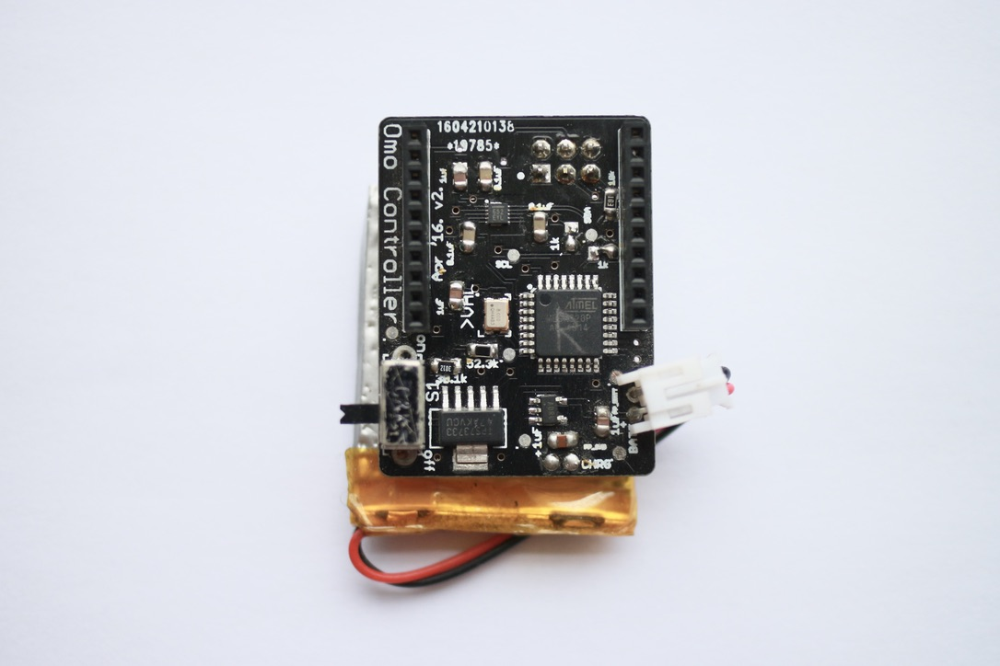
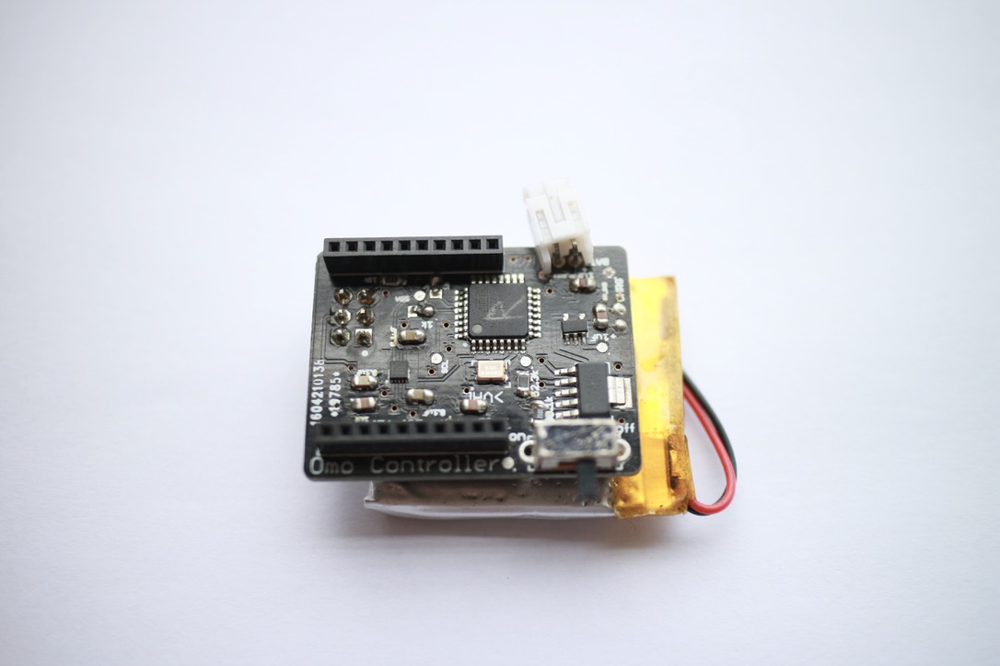
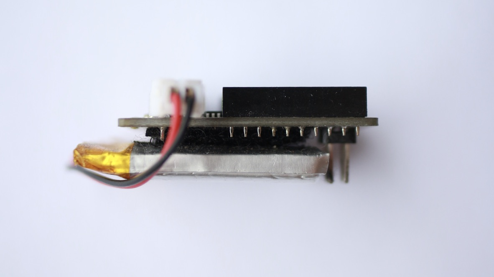

# OmoController
###### A wearable game controller that tracks scalar hand motion

The omo controller was designed to be embedded in the cuff of a boxing glove. When a punch is thrown, the unit transmits that event to a receiver, which was connected to a bespoke computer game. 

The unit has headers for an Xbee radio, which it would use to transmit data.

The controller measures 4x3x1.5cm, including 500mAh LiPo battery. The unit has charging circuitry on-board, which allows for charging from USB power.

The below controller travelled around South Africa as part of a promotional installation. 

## Schematic

## Parts

|Part|Name|
|:---|:---|
|Microcontroller|Atmel 328P, 3.3V, 8MHz|
|Accelerometer|NXP MMA8652FC|
|Charge controller|MAX1555|
|LDO Voltage Regulator|TI TPS73733|

## Programming

 - Use 3.3v ICSP programmer
 - If using a fresh chip, burn the Arduino 3.3V 8MHz bootloader to set fuse bits
